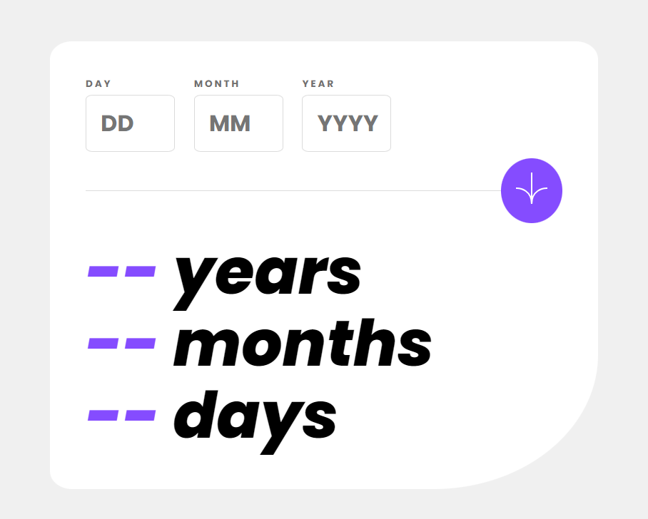
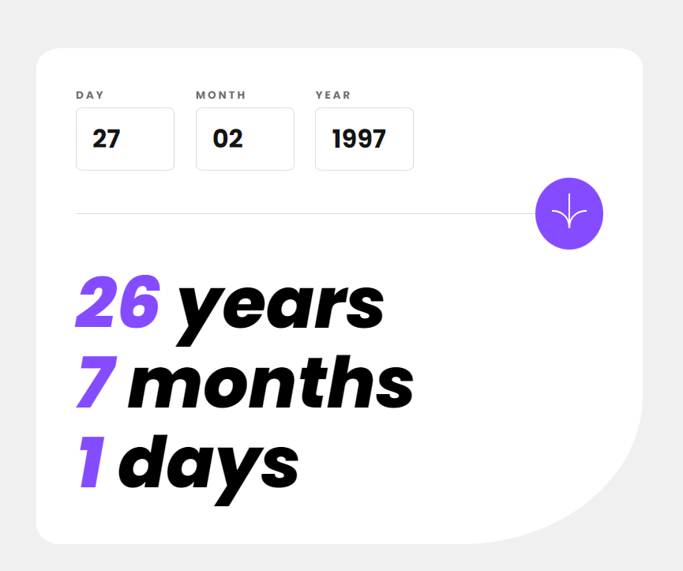
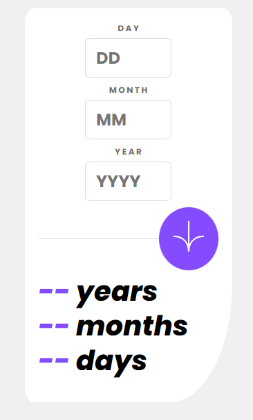
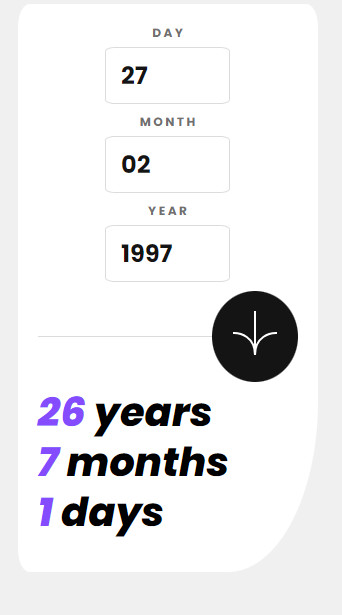

# Frontend Mentor - Age calculator app solution

This is a solution to the [Age calculator app challenge on Frontend Mentor](https://www.frontendmentor.io/challenges/age-calculator-app-dF9DFFpj-Q). Frontend Mentor challenges help you improve your coding skills by building realistic projects. 

## Table of contents

- [Overview](#overview)
  - [The challenge](#the-challenge)
  - [Screenshot](#screenshot)
  - [Links](#links)
- [My process](#my-process)
  - [Built with](#built-with)
  - [What I learned](#what-i-learned)
  - [Useful resources](#useful-resources)

## Overview

### The challenge

Users should be able to:

- View an age in years, months, and days after submitting a valid date through the form
- Receive validation errors if:
  - Any field is empty when the form is submitted
  - The day number is not between 1-31
  - The month number is not between 1-12
  - The year is in the future
  - The date is invalid e.g. 31/04/1991 (there are 30 days in April)
- View the optimal layout for the interface depending on their device's screen size
- See hover and focus states for all interactive elements on the page

### Screenshot

## Desktop




## Mobile




### Links

- Live Site URL: [Check the live here!](https://imfantin.github.io/Age-Calculator/)

## My process

### Built with

- Semantic HTML5 markup
- CSS custom properties
- Flexbox
- [Javascript](https://www.javascript.com/)

### What I learned

Even simple projects will make you wrap some ideas to complete it. 

```function isValidDate(day, month, year) {
    let maxDaysInMonth = new Date(year, month, 0).getDate();
    return day >= 1 && day <= maxDaysInMonth;
}
```
- It was interesting to learn how to pull the last day of the current month.
- Also resetting a JS style setting it to null was new to me. I was thinking of a much more complicated way of doing it when I just had to set it null.

### Useful resources

- [StackOverflow](https://stackoverflow.com/questions/10698942/how-to-return-a-javascript-set-style-property-to-css-default) - This helped me understand a simple way to reset my JS styles to default.
